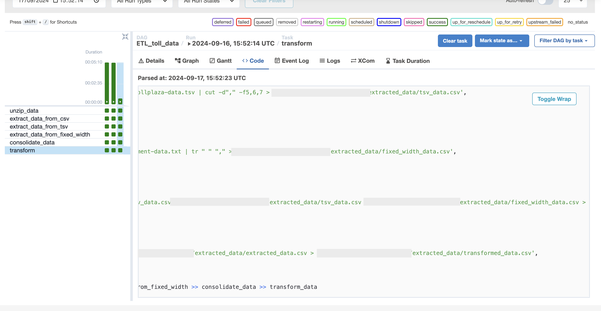

# ETL_Toll_Data
Extract, Transform, Load using Airflow

# ETL Toll Data Project

This project demonstrates an ETL (Extract, Transform, Load) pipeline using Apache Airflow. The pipeline extracts data from multiple file formats, consolidates the extracted data into a single CSV file, and performs a transformation on specific fields. Below is an overview of the steps involved in setting up the ETL pipeline.

## Project Overview

The ETL pipeline is defined in the `ETL_toll_data.py` file, which contains the DAG (Directed Acyclic Graph) configuration and task definitions. The pipeline processes toll data from various sources such as CSV, TSV, and fixed-width files, and consolidates them into a structured format for further use.

## Files and Structure

- **ETL_toll_data.py**: The main Python file that defines the DAG and all the ETL tasks.
- **Data files**:
  - `vehicle-data.csv`: Contains vehicle data.
  - `tollplaza-data.tsv`: Contains toll plaza data.
  - `payment-data.txt`: Contains payment information in fixed-width format.

## Steps Involved

1. **Define DAG Arguments**:
   - The DAG is defined with the following parameters:
     - `owner`: A dummy name.
     - `start_date`: Today.
     - `email`: A dummy email.
     - `email_on_failure`: Set to `True`.
     - `email_on_retry`: Set to `True`.
     - `retries`: 1 retry.
     - `retry_delay`: 5 minutes.

2. **Define DAG**:
   - The DAG is named `ETL_toll_data` and scheduled to run once daily. It uses the `default_args` defined in the previous step and is described as "Apache Airflow Final Assignment".

3. **ETL Tasks**:

   - **unzip_data**: Unzips the data file (downloaded as part of the lab setup) using the `tar` command into the destination directory.
   
   - **extract_data_from_csv**: Extracts specific fields (`Rowid`, `Timestamp`, `Anonymized Vehicle number`, `Vehicle type`) from `vehicle-data.csv` and saves them into `csv_data.csv`.

   - **extract_data_from_tsv**: Extracts fields (`Number of axles`, `Tollplaza id`, `Tollplaza code`) from `tollplaza-data.tsv` and saves them into `tsv_data.csv`.

   - **extract_data_from_fixed_width**: Extracts fields (`Type of Payment code`, `Vehicle Code`) from `payment-data.txt` and saves them into `fixed_width_data.csv`.

   - **consolidate_data**: Combines the extracted data from the three files (`csv_data.csv`, `tsv_data.csv`, `fixed_width_data.csv`) into a single consolidated CSV file `extracted_data.csv`. The final CSV includes the fields in the following order:
     - `Rowid`
     - `Timestamp`
     - `Anonymized Vehicle number`
     - `Vehicle type`
     - `Number of axles`
     - `Tollplaza id`
     - `Tollplaza code`
     - `Type of Payment code`
     - `Vehicle Code`
     - This is done using the `paste` command.

   - **transform_data**: Transforms the `vehicle_type` field in `extracted_data.csv` by converting it to uppercase, and saves the result into `transformed_data.csv` in the staging directory. This transformation is performed using the `tr` command in the `BashOperator`.

## Directory Structure

The project files, including the `ETL_toll_data.py` file, should be placed in a directory of your choice. The directory structure mentioned here is based on the example `/home/project`, but you can customize it according to your local environment. Ensure that you update the paths in the DAG file accordingly to match your local setup.

**Note**: The directory paths used in this project, such as `/home/project`, are examples. Please adjust these paths based on your own system's directory structure.

## How to Run

1. Clone the repository.
2. Navigate to the `/home/project` directory.
3. Create the DAG file named `ETL_toll_data.py`.
4. Set up Apache Airflow to schedule and manage the pipeline.
5. Run the DAG and monitor its execution.

## Dependencies

Make sure to install the following dependencies:

- Apache Airflow
- Python (for scripting)
- Bash (for shell commands)

## Results

After successfully setting up and running the DAG, you should be able to monitor its execution through the Airflow UI. Below is a screenshot showing the successful execution of all the tasks in the DAG.

The DAG shows the following task execution flow:
1. `unzip_data` – Unzips the downloaded data file.
2. `extract_data_from_csv` – Extracts data from the CSV file.
3. `extract_data_from_tsv` – Extracts data from the TSV file.
4. `extract_data_from_fixed_width` – Extracts data from the fixed-width file.
5. `consolidate_data` – Combines all extracted data into a single CSV file.
6. `transform_data` – Transforms and finalizes the consolidated data.

The Airflow UI allows you to track task statuses (e.g., success, failure, retry) and view logs for detailed information on each task's execution.
